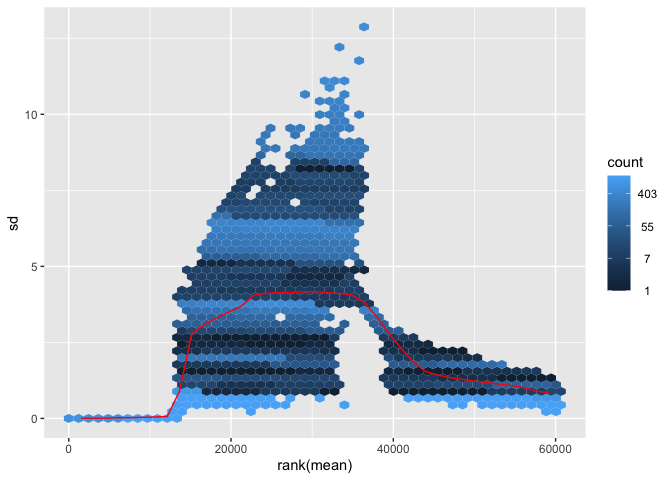

Untitled
================

# **TRGN510 Final Project**

## Title

Differential Expression Comparing Females vs Male Paragangliomas &
Glomus Tumors from NCI GDC Datasets using DeSEQ2 package

## Author

Bigy Ambat

## Description of Project

I will be comparing the differential expression of Paragangliomas &
Glomus Tumors in Female vs Male patients. Analysis will using the DeSEQ2
R Package and will be using the following vignette:
<http://bioconductor.org/packages/release/bioc/vignettes/DESeq2/inst/doc/DESeq2.html>.

For this analysis, I will be data from the NCI GDC database from Link to
the dataset is below (with filters on)

<https://portal.gdc.cancer.gov/exploration?filters=%7B%22op%22%3A%22and%22%2C%22content%22%3A%5B%7B%22content%22%3A%7B%22field%22%3A%22cases.demographic.vital_status%22%2C%22value%22%3A%5B%22alive%22%5D%7D%2C%22op%22%3A%22in%22%7D%2C%7B%22op%22%3A%22in%22%2C%22content%22%3A%7B%22field%22%3A%22cases.disease_type%22%2C%22value%22%3A%5B%22paragangliomas%20and%20glomus%20tumors%22%5D%7D%7D%2C%7B%22op%22%3A%22in%22%2C%22content%22%3A%7B%22field%22%3A%22cases.primary_site%22%2C%22value%22%3A%5B%22adrenal%20gland%22%5D%7D%7D%2C%7B%22op%22%3A%22in%22%2C%22content%22%3A%7B%22field%22%3A%22cases.project.program.name%22%2C%22value%22%3A%5B%22TCGA%22%5D%7D%7D%2C%7B%22op%22%3A%22in%22%2C%22content%22%3A%7B%22field%22%3A%22cases.samples.sample_type%22%2C%22value%22%3A%5B%22primary%20tumor%22%5D%7D%7D%5D%7D&searchTableTab=cases>

The dataset includes 144 star-counts files (split into 61 Males and 83
Females). Datset is only using the TCGA cohort. Dataset is controlling
for Primary Tumor and only considering those that are Alive.

## Data

I will be using data from NCI GDC. As mentioned, there are 144 Star
count files. However, the dataset below has not been filtered for the
parameters above. Data wrangling will occur using Python, Bash, & R. All
commands be documented along with the vignette.

Star-count files, clinical data, and other relavent files from GDC cart
are uploaded to Github with this README

## **Data Wrangling**

The data from the GDC portal must be formatted properly for the DeSEQ2
vignette to function. Initial wrangling is completed using Python (in
Jupyter Notebook) and R (in R Studio)

Create a folder called “TRGN510_Final Project” which includes the
“clinical.cart” and “gdc_download” folders from GDC.

Inside the “clinical.cart” folder, find the clinical.tsv folder and move
it back a level to the “TRGN510_Final Project” folder

## Initial Wrangling of Data

Looking inside the folder labeled “gdc_download_20221122_055006.438971”
reveals all the star_count tsv files (which are embedded in unique
star_counts folders). Each star_count tsv file represents a sample.

Make sure to complete the following steps under the “gdc_download”
folder above:

**1.Take all Star Count tsv files out of their respective folders for
all samples**

**2.Use the following Bash commands to separate a column from one of the
tsv files**

Convert one of the tsv files to a txt file

``` bash
0176f3d4-979e-4364-a703-a26e2b52ed84.rna_seq.augmented_star_gene_counts.tsv >test.txt
```

Remove the first column of the test.txt file and create a new txt file

``` bash
tail -n +2 test.txt > test2.txt
```

Extract the gene_id column from the test2.txt file

``` bash
awk'{print $0}' test2.txt > test3.txt
```

We will be using the test3.txt file as an update file to iteratively add
data from each of the tsv files.

**3.Create a python script that selects the unstranded column from each
star counts file and adds it as a new column to the test3.txt file
(which contains the gene_id column). Here is the python script.**

Ensure that you are in the same directory as the tsv files and the
test3.txt for this script to work. Additionally, make sure to modify
file pathways.

``` bash
#!/usr/bin/python
import sys
import re
import fileinput
import pandas as pd 
import os 

#The function of this python script is to select the unstranded DNA column of each star-counts tsv file and bring that data into a new file. 

# directory name
dirname = '/Users/bigyambat/Documents/GitHub/TRGN510_FinalProject/gdc_download_20221122_055006.438971'
 
# extensions
ext = ('.tsv')
 
# scanning the directory to get required files

#Making test3.txt as the csv update file
update_file = pd.read_csv("test3.txt", sep="\t")


#Searches through each tsv file and finds "unstranded" column. Appends it to  test3.txt (which is now converted to a dataframe). New file is CSV_Manifest3

for files in os.scandir(dirname):
    if files.path.endswith(ext):
        #print(files)  # printing file name
        gene_file = pd.read_csv(files, sep="\t", header=1)
        unstranded_column = gene_file['unstranded']
        update_file[files.name] = unstranded_column

update_file.to_csv(r'/Users/bigyambat/Documents/GitHub/TRGN510_FinalProject/CSV_Manifest3.csv', index=False)
```

The python script will create a CSV_Manifest3.csv file which will be
used for further wrangling in R. This csv file will be located inside
the “TRGN510_Final Project” folder.

## Data Wrangling in R

The rest of the data wrangling will be completed in R. Create a new R
script and run the following commands

``` r
setwd("/Users/bigyambat/Documents/GitHub/TRGN510_FinalProject")
```

Install Bioconductor using the following commands in R. Use the
BiocManager command to install the following packages from Bioconductor.
Only install if BiocManager is not on your local machine.

``` r
Bioconductor Install for version 3.16
if (!require("BiocManager", quietly = TRUE))
  install.packages("BiocManager")
BiocManager::install(version = "3.16")
```

Install the following packages from Bioconductor using the command
below. Only install if packages are not on local machine

``` r
BiocManager::install("DeSeq2")
BiocManager::install("dplyr")
BiocManager::install("apeglm")
BiocManager::install("vsn")
BiocManager::install("pheatmap")
```

Load libraries for analysis

``` r
library(DESeq2)
```

    ## Warning: package 'DESeq2' was built under R version 4.2.2

    ## Loading required package: S4Vectors

    ## Warning: package 'S4Vectors' was built under R version 4.2.2

    ## Loading required package: stats4

    ## Loading required package: BiocGenerics

    ## 
    ## Attaching package: 'BiocGenerics'

    ## The following objects are masked from 'package:stats':
    ## 
    ##     IQR, mad, sd, var, xtabs

    ## The following objects are masked from 'package:base':
    ## 
    ##     anyDuplicated, aperm, append, as.data.frame, basename, cbind,
    ##     colnames, dirname, do.call, duplicated, eval, evalq, Filter, Find,
    ##     get, grep, grepl, intersect, is.unsorted, lapply, Map, mapply,
    ##     match, mget, order, paste, pmax, pmax.int, pmin, pmin.int,
    ##     Position, rank, rbind, Reduce, rownames, sapply, setdiff, sort,
    ##     table, tapply, union, unique, unsplit, which.max, which.min

    ## 
    ## Attaching package: 'S4Vectors'

    ## The following objects are masked from 'package:base':
    ## 
    ##     expand.grid, I, unname

    ## Loading required package: IRanges

    ## Loading required package: GenomicRanges

    ## Loading required package: GenomeInfoDb

    ## Warning: package 'GenomeInfoDb' was built under R version 4.2.2

    ## Loading required package: SummarizedExperiment

    ## Loading required package: MatrixGenerics

    ## Loading required package: matrixStats

    ## 
    ## Attaching package: 'MatrixGenerics'

    ## The following objects are masked from 'package:matrixStats':
    ## 
    ##     colAlls, colAnyNAs, colAnys, colAvgsPerRowSet, colCollapse,
    ##     colCounts, colCummaxs, colCummins, colCumprods, colCumsums,
    ##     colDiffs, colIQRDiffs, colIQRs, colLogSumExps, colMadDiffs,
    ##     colMads, colMaxs, colMeans2, colMedians, colMins, colOrderStats,
    ##     colProds, colQuantiles, colRanges, colRanks, colSdDiffs, colSds,
    ##     colSums2, colTabulates, colVarDiffs, colVars, colWeightedMads,
    ##     colWeightedMeans, colWeightedMedians, colWeightedSds,
    ##     colWeightedVars, rowAlls, rowAnyNAs, rowAnys, rowAvgsPerColSet,
    ##     rowCollapse, rowCounts, rowCummaxs, rowCummins, rowCumprods,
    ##     rowCumsums, rowDiffs, rowIQRDiffs, rowIQRs, rowLogSumExps,
    ##     rowMadDiffs, rowMads, rowMaxs, rowMeans2, rowMedians, rowMins,
    ##     rowOrderStats, rowProds, rowQuantiles, rowRanges, rowRanks,
    ##     rowSdDiffs, rowSds, rowSums2, rowTabulates, rowVarDiffs, rowVars,
    ##     rowWeightedMads, rowWeightedMeans, rowWeightedMedians,
    ##     rowWeightedSds, rowWeightedVars

    ## Loading required package: Biobase

    ## Welcome to Bioconductor
    ## 
    ##     Vignettes contain introductory material; view with
    ##     'browseVignettes()'. To cite Bioconductor, see
    ##     'citation("Biobase")', and for packages 'citation("pkgname")'.

    ## 
    ## Attaching package: 'Biobase'

    ## The following object is masked from 'package:MatrixGenerics':
    ## 
    ##     rowMedians

    ## The following objects are masked from 'package:matrixStats':
    ## 
    ##     anyMissing, rowMedians

``` r
library(dplyr)
```

    ## 
    ## Attaching package: 'dplyr'

    ## The following object is masked from 'package:Biobase':
    ## 
    ##     combine

    ## The following object is masked from 'package:matrixStats':
    ## 
    ##     count

    ## The following objects are masked from 'package:GenomicRanges':
    ## 
    ##     intersect, setdiff, union

    ## The following object is masked from 'package:GenomeInfoDb':
    ## 
    ##     intersect

    ## The following objects are masked from 'package:IRanges':
    ## 
    ##     collapse, desc, intersect, setdiff, slice, union

    ## The following objects are masked from 'package:S4Vectors':
    ## 
    ##     first, intersect, rename, setdiff, setequal, union

    ## The following objects are masked from 'package:BiocGenerics':
    ## 
    ##     combine, intersect, setdiff, union

    ## The following objects are masked from 'package:stats':
    ## 
    ##     filter, lag

    ## The following objects are masked from 'package:base':
    ## 
    ##     intersect, setdiff, setequal, union

``` r
library(apeglm)
library(vsn)
library(pheatmap)
```

Read in CSV_Manifest3.csv into R

``` r
#Refer to comment below for reason behind setting header = FALSE. If issue does not apply, skip lines 15-17
Star_Matrix <- read.csv(file = 'CSV_Manifest3.csv', header = FALSE)

#Known Issue => R Studio reading messed up the header (with long file names). So, set header to false to avoid issue and make Row 1 the column name manually
colnames(Star_Matrix) <- Star_Matrix[1,]
Star_Matrix <- Star_Matrix[-1,]


#Removing irrelavent unstranded reads (ie N_Unmapped, etc)
Star_Matrix2 <- Star_Matrix[-(1:4),]
```

Read in clinical.tsv into R

``` r
#Reading in clinical.tsv file
clinical_sample <- read.csv(file = 'clinical.tsv', sep = "\t", header = TRUE)

#Clinical Data file has 2 rows for each sample. Selecting for every other row. 
clinical_sample2 <- clinical_sample[c(rep(FALSE,1),TRUE), ]

#Assigning row names starting from 1
rownames(clinical_sample2) <- 1:nrow(clinical_sample2)

#Selecting for relavent columns in clinical sample
clinical_sample3 <- clinical_sample2[, c(2,1,12)]

#Ordering clinical sample by gender
clinical_sample4 <- clinical_sample3[order(clinical_sample3$gender),]

#Making clinical sample ids as row names
rownames(clinical_sample4) <- clinical_sample4$case_submitter_id

#Removing irrelavent 1st column
clinical_sample4 <- clinical_sample4[-c(1)]
```

Read in GDC Sample Data into R

``` r
#Reading Sample Name files which has all the different formats/names for each sample
Sample_Name_File <- read.csv(file = 'gdc_sample_sheet.2022-11-21.tsv', sep = "\t", header = TRUE)

#Selecing for File name & case.id columns
Sample_Name_File2 = subset(Sample_Name_File, select = -c(1, 3:5, 7:8) )

#Changing Case.ID Column to "case_submitter_id" to match Star_Matrix column
colnames(Sample_Name_File2) <- c("File.Name", "case_submitter_id")
```

Rename column names of Sample Matrix to match respective
case_submitter_id

``` r
#Changing the column names (file names) of Star_Matrix2 to their respective case_submitter_id counterpart
#Known Issue: Since case_submitter ids are out of order compared to the Star_Matrix file names, this has to be done manually by cross-referencing Sample_Name_File2 to Star_Matrix2 :(
#Easiest way to do this is to alphabetize  Sample_Name_File2 

colnames(Star_Matrix2) <- c("gene_id","TCGA-P7-A5NX","TCGA-SP-A6QC", "TCGA-S7-A7WL", "TCGA-RW-A7D0", "TCGA-WB-A817", "TCGA-W2-A7H7", "TCGA-WB-A81T", "TCGA-S7-A7WN", "TCGA-QR-A70O", "TCGA-XG-A823", "TCGA-WB-A81G", "TCGA-S7-A7WW", "TCGA-SR-A6MZ", "TCGA-QR-A707", "TCGA-QR-A70E", "TCGA-QR-A703", "TCGA-QR-A70V", "TCGA-QR-A70K", "TCGA-P8-A5KC", "TCGA-WB-A81D", "TCGA-WB-A81W", "TCGA-S7-A7X2", "TCGA-QR-A6ZZ", "TCGA-QR-A700", "TCGA-QR-A6GR", "TCGA-WB-A80L", "TCGA-QR-A70A", "TCGA-S7-A7WO", "TCGA-WB-A81R", "TCGA-P7-A5NY", "TCGA-RW-A68G", "TCGA-RW-A67W", "TCGA-WB-A81P", "TCGA-RW-A681", "TCGA-SR-A6N0", "TCGA-RW-A686", "TCGA-WB-A816", "TCGA-P7-A5NY", "TCGA-RW-A68F", "TCGA-RW-A68A", "TCGA-W2-A7H5", "TCGA-SR-A6MS", "TCGA-WB-A815", "TCGA-SR-A6MV", "TCGA-WB-A80Q", "TCGA-WB-A822", "TCGA-S7-A7WP", "TCGA-SP-A6QK", "TCGA-QR-A6GY", "TCGA-W2-A7HF", "TCGA-RW-A686", "TCGA-SR-A6MP", "TCGA-WB-A81F", "TCGA-WB-A81M", "TCGA-P8-A6RY", "TCGA-SR-A6MT", "TCGA-W2-A7HD", "TCGA-SQ-A6I4", "TCGA-WB-A80K", "TCGA-RW-A685", "TCGA-QR-A6GZ", "TCGA-WB-A80V", "TCGA-WB-A818", "TCGA-RW-A68D", "TCGA-S7-A7WM", "TCGA-RW-A68C", "TCGA-W2-A7HA", "TCGA-QT-A5XL", "TCGA-QR-A70M", "TCGA-WB-A81J", "TCGA-RW-A67X", "TCGA-QR-A6GO", "TCGA-QR-A70G", "TCGA-RW-A68B", "TCGA-QR-A70C", "TCGA-QR-A6GU", "TCGA-WB-A80M", "TCGA-WB-A80O", "TCGA-PR-A5PH", "TCGA-QR-A70W", "TCGA-TT-A6YJ", "TCGA-WB-A80N", "TCGA-QT-A5XP", "TCGA-S7-A7WX", "TCGA-SP-A6QI", "TCGA-RT-A6YC", "TCGA-SP-A6QD", "TCGA-QR-A70N", "TCGA-RW-A688", "TCGA-QR-A6GS", "TCGA-S7-A7WR", "TCGA-TT-A6YP", "TCGA-QT-A5XO", "TCGA-WB-A81K", "TCGA-WB-A81V", "TCGA-TT-A6YN", "TCGA-QT-A5XM", "TCGA-SP-A6QF", "TCGA-WB-A81H", "TCGA-SQ-A6I4","TCGA-SR-A6MY", "TCGA-S7-A7WV", "TCGA-QR-A6H4", "TCGA-QR-A6H2", "TCGA-W2-A7HE", "TCGA-QR-A6GX", "TCGA-SR-A6MU", "TCGA-P8-A5KC","TCGA-TT-A6YO", "TCGA-W2-A7HC", "TCGA-SP-A6QH", "TCGA-QT-A5XK", "TCGA-QR-A6H1", "TCGA-WB-A81S", "TCGA-QR-A70R", "TCGA-WB-A821", "TCGA-S7-A7X1", "TCGA-RW-A684", "TCGA-QR-A70H", "TCGA-QR-A6H5", "TCGA-QR-A70U", "TCGA-QR-A7IN", "TCGA-P8-A5KD", "TCGA-QR-A70J", "TCGA-WB-A81I", "TCGA-WB-A81N", "TCGA-P8-A5KD", "TCGA-RT-A6YA", "TCGA-QR-A708", "TCGA-QT-A69Q", "TCGA-S7-A7WT", "TCGA-PR-A5PF", "TCGA-QR-A6GW", "TCGA-SQ-A6I6", "TCGA-WB-A81A", "TCGA-RW-A67Y", "TCGA-WB-A819", "TCGA-QR-A70X", "TCGA-QR-A6GZ", "TCGA-RW-A67V", "TCGA-QT-A5XJ", "TCGA-W2-A7UY", "TCGA-SP-A6QJ", "TCGA-PR-A5PG", "TCGA-W2-A7HB", "TCGA-RT-A6Y9", "TCGA-S7-A7WU", "TCGA-S7-A7WQ", "TCGA-RW-A689", "TCGA-QT-A5XN")
```

Match Star_Matrix columns to row names in Clinical_Sample

``` r
#There are duplicated sample names in the Star_Matrix. I used the command below to remove duplicate column names. 
Star_Matrix3 <- Star_Matrix2[, !duplicated(colnames(Star_Matrix2))]

#Changing column 1 (gene_id) to row names and removing 1st column (which is now redundant)
Star_Matrix4 <- Star_Matrix3
row.names(Star_Matrix4) <- Star_Matrix3$gene_id
Star_Matrix4 <- Star_Matrix4[-c(1)]

#Ordering Star_Matrix to align with order of row names in clinical_sample
Star_Matrix5 <- Star_Matrix4[match(rownames(clinical_sample4), colnames(Star_Matrix4))]

#Converting Star_Matrix from datafram to a data matrix
Star_Matrix6 <- data.matrix(Star_Matrix5)
```

## **DESeq2 Vignette**

### DESeq Command

All data is now properly formatted for use in DESeq2 vignette. From
here, follow the instructions of the vignette.

Load in the Star_Matrix6 & clinical_sample5 as cts and coldata
respectively

``` r
cts <- Star_Matrix6
coldata <- clinical_sample4
```

Loading all counts, clinical samples, and selecting for gender as
variable of interest into dds object

``` r
dds <- DESeqDataSetFromMatrix(countData = cts,
                              colData = coldata,
                              design= ~ gender)
```

    ## Warning in DESeqDataSet(se, design = design, ignoreRank): some variables in
    ## design formula are characters, converting to factors

``` r
# Ignore warning if it appears
```

DESeq command tests for the following:

estimating size factors estimating dispersions gene-wise dispersion
estimates mean-dispersion relationship final dispersion estimates
fitting model and testing – replacing outliers and refitting for 13396
genes – DESeq argument ‘minReplicatesForReplace’ = 7 – original counts
are preserved in counts(dds) estimating dispersions fitting model and
testing

Run the DeSeq command below

``` r
dds <- DESeq(dds)
```

    ## estimating size factors

    ## estimating dispersions

    ## gene-wise dispersion estimates

    ## mean-dispersion relationship

    ## final dispersion estimates

    ## fitting model and testing

    ## -- replacing outliers and refitting for 13396 genes
    ## -- DESeq argument 'minReplicatesForReplace' = 7 
    ## -- original counts are preserved in counts(dds)

    ## estimating dispersions

    ## fitting model and testing

``` r
#Note: Command may take 5-10 minutes
```

### Pre-Filtering

Pre-Filtering is sometimes required to remove extraneous or unnecessary.
Independent filtering is later on this dataset.

``` r
#Number of total genes from dds object
nrow(dds)
```

    ## [1] 60660

``` r
#Filtering for genes that have at least 10 reads across each gene
keep <- rowSums(counts(dds)) >= 10
dds <- dds[keep,]

#Number of total genes after pre-filtering
nrow(dds)
```

    ## [1] 60660

It looks like all the genes have at least 10 reads. So, there was no
change in the dataset.

``` r
#Only need to run this you pre-filtered out genes.
dds <- DESeq(dds)
```

Prints results of dds to a new variable.

``` r
res <- results( dds )
head(res)
```

    ## log2 fold change (MLE): gender male vs female 
    ## Wald test p-value: gender male vs female 
    ## DataFrame with 6 rows and 6 columns
    ##                     baseMean log2FoldChange     lfcSE      stat    pvalue
    ##                    <numeric>      <numeric> <numeric> <numeric> <numeric>
    ## ENSG00000000003.15   2528.51      0.0702222  0.172998  0.405913  0.684806
    ## ENSG00000000005.6    1565.27     -0.3847082  0.487052 -0.789871  0.429603
    ## ENSG00000000419.13   1340.08      0.2569590  0.253442  1.013876  0.310642
    ## ENSG00000000457.14   3165.00      0.0373373  0.115030  0.324588  0.745493
    ## ENSG00000000460.17   2648.39      0.2807648  0.246915  1.137092  0.255500
    ## ENSG00000000938.13   2142.39      0.2453722  0.201229  1.219370  0.222704
    ##                         padj
    ##                    <numeric>
    ## ENSG00000000003.15  0.999823
    ## ENSG00000000005.6   0.999823
    ## ENSG00000000419.13  0.999823
    ## ENSG00000000457.14  0.999823
    ## ENSG00000000460.17  0.999823
    ## ENSG00000000938.13  0.999823

**Meaning of Data** Base Mean = Average of the normalized count values
log2(FoldChange) = Change in gene expression between male and female
lfcSE = Standard Error of the log2 fold change values stat = Wald’s test
to determine the weighted distance between gene expression pvalue =
Hypothesis test to tell whether expression difference is significant
padj Adjusted P values based on the Benjamini-Hochberg adjustment

### Log fold change shrinkage for visualization and ranking using lfcShrink function

Shrinkage does not change the fold changes of differential gene
expression. Its function is to help with downstream assessments of
results. LfcShrink adds a shrunken log2fold change and standard error
results table from DESeq. Use the apeglm method for best shrinkage
results.

``` r
resultsNames(dds)
```

    ## [1] "Intercept"             "gender_male_vs_female"

``` r
#Use the output of resultNames(dds) as the coef for the lfcShrink command (May take some time)
resLFC <- lfcShrink(dds, coef="gender_male_vs_female", type="apeglm")
```

    ## using 'apeglm' for LFC shrinkage. If used in published research, please cite:
    ##     Zhu, A., Ibrahim, J.G., Love, M.I. (2018) Heavy-tailed prior distributions for
    ##     sequence count data: removing the noise and preserving large differences.
    ##     Bioinformatics. https://doi.org/10.1093/bioinformatics/bty895

``` r
resLFC
```

    ## log2 fold change (MAP): gender male vs female 
    ## Wald test p-value: gender male vs female 
    ## DataFrame with 60660 rows and 5 columns
    ##                      baseMean log2FoldChange     lfcSE    pvalue      padj
    ##                     <numeric>      <numeric> <numeric> <numeric> <numeric>
    ## ENSG00000000003.15    2528.51      0.0553965  0.154203  0.684806  0.999823
    ## ENSG00000000005.6     1565.27     -0.1273310  0.297629  0.429603  0.999823
    ## ENSG00000000419.13    1340.08      0.1703688  0.214150  0.310642  0.999823
    ## ENSG00000000457.14    3165.00      0.0333878  0.108876  0.745493  0.999823
    ## ENSG00000000460.17    2648.39      0.1910405  0.212757  0.255500  0.999823
    ## ...                       ...            ...       ...       ...       ...
    ## ENSG00000288669.1     1.11184    -0.73249573 0.0453985  0.786729  0.999823
    ## ENSG00000288670.1  3005.24684     0.11320343 0.1275470  0.342969  0.999823
    ## ENSG00000288671.1     1.02036    -0.00416982 0.1966919  0.979162        NA
    ## ENSG00000288674.1  2850.85880     0.01982401 0.2224301  0.887384  0.999823
    ## ENSG00000288675.1  2905.65144    -0.13807426 0.1832544  0.369223  0.999823

``` r
#Citation for using apeglm with lfcShrink command
#using 'apeglm' for LFC shrinkage. If used in published research, please cite:
  #Zhu, A., Ibrahim, J.G., Love, M.I. (2018) Heavy-tailed prior distributions for
#sequence count data: removing the noise and preserving large differences.
#Bioinformatics. https://doi.org/10.1093/bioinformatics/bty895
```

### P-Values and Adjusted P-Values

Ordering P-Values by smallest

``` r
resOrdered <- res[order(res$pvalue),]

summary(res)
```

    ## 
    ## out of 60660 with nonzero total read count
    ## adjusted p-value < 0.1
    ## LFC > 0 (up)       : 354, 0.58%
    ## LFC < 0 (down)     : 1274, 2.1%
    ## outliers [1]       : 0, 0%
    ## low counts [2]     : 17641, 29%
    ## (mean count < 1)
    ## [1] see 'cooksCutoff' argument of ?results
    ## [2] see 'independentFiltering' argument of ?results

P-Values less than 0.1

``` r
sum(res$padj < 0.1, na.rm=TRUE)
```

    ## [1] 1628

### MA Plots

MA plots show the log2(fold) differences with respect to the mean of
normalized counts for all samples

MA Plot of All Genes

``` r
plotMA(res, ylim=c(-2,2))
```

<!-- -->

MA Plot of Shrunken Genes

``` r
plotMA(resLFC, ylim=c(-2,2))
```

<!-- -->
\### Plot Counts Plots normalized counts with a pseudocount of 0.5.
Variable of interest is specified as intgroup

``` r
#Plot count for gene with the lowest adjusted p value
plotCounts(dds, gene=which.min(res$padj), intgroup="gender")
```

<!-- -->
\### Extracting transformed values Two types of transformation methods:
vst and rlog Transformed values are required to create PCA Plots and
Heatmaps. Use blind = FALSE for faster runtime. Note: Rlog may take a
12-24 hours

``` r
vsd <- vst(dds, blind=FALSE)
rld <- rlog(dds, blind=FALSE)
```

    ## rlog() may take a long time with 50 or more samples,
    ## vst() is a much faster transformation

``` r
head(assay(vsd), 3)
```

    ##                    TCGA-QR-A708 TCGA-S7-A7WR TCGA-QR-A70V TCGA-WB-A816
    ## ENSG00000000003.15     11.99756    12.290345     8.782487     9.478936
    ## ENSG00000000005.6      10.28762     2.610370     2.610370    10.953238
    ## ENSG00000000419.13     11.97982     9.878281     8.792378    10.431279
    ##                    TCGA-RT-A6Y9 TCGA-QR-A6GR TCGA-S7-A7WU TCGA-RW-A685
    ## ENSG00000000003.15    12.389613    11.379169    12.054806     12.46306
    ## ENSG00000000005.6     12.092803    12.152598    11.690888     11.38596
    ## ENSG00000000419.13     9.503111     8.567217     9.795104     10.23862
    ##                    TCGA-PR-A5PG TCGA-QT-A5XK TCGA-QR-A70X TCGA-QR-A70J
    ## ENSG00000000003.15    10.380704    10.689633      9.68588    11.832655
    ## ENSG00000000005.6     10.586993     2.265799     10.94131    10.900502
    ## ENSG00000000419.13     9.684583     8.172783     11.71282     8.844523
    ##                    TCGA-QR-A6GS TCGA-WB-A80V TCGA-SR-A6MS TCGA-SR-A6N0
    ## ENSG00000000003.15    11.674572     9.546062    11.587086     9.978716
    ## ENSG00000000005.6     11.780151    10.386884     2.632972    11.836732
    ## ENSG00000000419.13     9.571392     7.639995     6.888243    11.193778
    ##                    TCGA-SR-A6MV TCGA-WB-A81R TCGA-SP-A6QJ TCGA-WB-A821
    ## ENSG00000000003.15     10.89137    10.274967    10.761088    10.834268
    ## ENSG00000000005.6      11.57715     2.261654    10.398160    11.601773
    ## ENSG00000000419.13     11.67204     9.615904     8.674757     9.862136
    ##                    TCGA-P7-A5NX TCGA-SP-A6QK TCGA-RT-A6YA TCGA-SR-A6MY
    ## ENSG00000000003.15      12.1116    12.018452     9.850149    11.154167
    ## ENSG00000000005.6       12.2947     2.618803    11.604541     2.261654
    ## ENSG00000000419.13       8.3739     9.631021     9.455029     9.324797
    ##                    TCGA-RW-A68A TCGA-WB-A80O TCGA-WB-A81N TCGA-TT-A6YN
    ## ENSG00000000003.15     12.07834     11.09783    12.147187    10.203128
    ## ENSG00000000005.6      11.95609     12.31505     2.607571    11.405775
    ## ENSG00000000419.13      9.62700      9.92306     9.151993     9.331473
    ##                    TCGA-QR-A6GY TCGA-WB-A815 TCGA-S7-A7WP TCGA-QR-A70C
    ## ENSG00000000003.15    11.880024    11.999227    11.608278     11.53611
    ## ENSG00000000005.6      2.613176     2.870420     2.261654     10.35543
    ## ENSG00000000419.13     9.193522     8.903787     5.439704     12.09356
    ##                    TCGA-WB-A81M TCGA-RW-A68F TCGA-QT-A5XN TCGA-QR-A6H5
    ## ENSG00000000003.15     11.25833     10.89117     11.12923    12.256106
    ## ENSG00000000005.6       2.61037     12.20674     10.72733    12.308487
    ## ENSG00000000419.13      9.63435     12.24778     10.45419     8.399885
    ##                    TCGA-SP-A6QH TCGA-RW-A68D TCGA-WB-A81D TCGA-W2-A7UY
    ## ENSG00000000003.15     11.31852    11.075566    10.858820     8.290255
    ## ENSG00000000005.6      10.33967    11.871507     2.259589     2.288051
    ## ENSG00000000419.13     12.01596     5.147202     9.250485    10.730536
    ##                    TCGA-W2-A7HF TCGA-TT-A6YP TCGA-S7-A7X2 TCGA-RW-A67Y
    ## ENSG00000000003.15    10.071901    12.135467    10.704693     9.804009
    ## ENSG00000000005.6      2.607571     2.610370     2.265799     2.263724
    ## ENSG00000000419.13     9.206994     7.224275     9.517790     9.049024
    ##                    TCGA-QR-A70A TCGA-SR-A6MP TCGA-QR-A707 TCGA-QT-A5XJ
    ## ENSG00000000003.15     10.80225    10.427973     8.924161    12.551033
    ## ENSG00000000005.6      12.01016     2.619595    10.596159     2.604777
    ## ENSG00000000419.13     11.80958    12.181347     9.668761    10.297128
    ##                    TCGA-WB-A80L TCGA-P8-A5KD TCGA-SR-A6MT TCGA-RW-A688
    ## ENSG00000000003.15    11.429223     9.822722     6.835113    10.649380
    ## ENSG00000000005.6     10.539596     2.267878    10.726533    11.702561
    ## ENSG00000000419.13     9.755726     9.846995     9.742035     9.183487
    ##                    TCGA-W2-A7HA TCGA-TT-A6YO TCGA-W2-A7H5 TCGA-PR-A5PF
    ## ENSG00000000003.15    10.634233     9.849791    12.335164     11.74254
    ## ENSG00000000005.6     12.369003     2.280067     2.604777     11.78713
    ## ENSG00000000419.13     9.557175    11.208230     5.087119      7.61240
    ##                    TCGA-RW-A67W TCGA-QR-A70E TCGA-SR-A6MZ TCGA-RW-A7D0
    ## ENSG00000000003.15     9.911961     10.61212    11.798171    12.171252
    ## ENSG00000000005.6     10.407587     12.49740     2.261654    10.586041
    ## ENSG00000000419.13    12.150950     10.68754     9.184136     9.232976
    ##                    TCGA-QR-A6GX TCGA-QR-A7IN TCGA-W2-A7HD TCGA-QR-A70O
    ## ENSG00000000003.15     5.841053     9.351986    11.147611    10.589010
    ## ENSG00000000005.6     12.121391     2.870420     2.613176     9.926344
    ## ENSG00000000419.13    10.062442     8.912926     8.186207    10.097704
    ##                    TCGA-WB-A81P TCGA-WB-A81H TCGA-QT-A5XO TCGA-WB-A81A
    ## ENSG00000000003.15     9.841665    12.109002    12.702647    12.183575
    ## ENSG00000000005.6     12.319874     2.610370     2.257528     8.583451
    ## ENSG00000000419.13     8.226804     9.213878    11.511351     9.611621
    ##                    TCGA-P7-A5NY TCGA-WB-A80Q TCGA-QR-A6GW TCGA-QR-A6ZZ
    ## ENSG00000000003.15     9.537570     11.42565    12.128855    12.070040
    ## ENSG00000000005.6      2.257528     11.30734    11.451526    11.281819
    ## ENSG00000000419.13    11.405241     10.97003     9.903516     6.665414
    ##                    TCGA-SR-A6MU TCGA-XG-A823 TCGA-S7-A7WV TCGA-RW-A684
    ## ENSG00000000003.15    11.480325     11.43086    12.295859    10.911183
    ## ENSG00000000005.6     11.879144     11.63086     2.610370    11.867152
    ## ENSG00000000419.13     6.647042     11.83027     9.559107     8.815577
    ##                    TCGA-QT-A5XP TCGA-TT-A6YJ TCGA-QR-A6H4 TCGA-RW-A67V
    ## ENSG00000000003.15     10.49434     9.636182    10.063857     9.894020
    ## ENSG00000000005.6      11.08069     2.261654    11.732700     2.291629
    ## ENSG00000000419.13     11.99256    10.252455     5.813517    11.214186
    ##                    TCGA-S7-A7WO TCGA-WB-A81S TCGA-QR-A70U TCGA-QR-A70M
    ## ENSG00000000003.15     9.733546    11.147878     9.664553    10.697677
    ## ENSG00000000005.6     11.221188     2.607571     2.265799    10.544213
    ## ENSG00000000419.13    10.116375     9.401740     9.207885     9.167417
    ##                    TCGA-RW-A68C TCGA-WB-A817 TCGA-RW-A68B TCGA-SQ-A6I4
    ## ENSG00000000003.15    12.095751    10.803923    10.905136    11.279312
    ## ENSG00000000005.6     11.767999     2.263724    10.590330     2.615987
    ## ENSG00000000419.13     9.619612     8.568106     9.859776     6.796380
    ##                    TCGA-S7-A7WL TCGA-RW-A686 TCGA-RT-A6YC TCGA-P8-A5KC
    ## ENSG00000000003.15    10.907446    11.851177     8.688700     7.207553
    ## ENSG00000000005.6     11.624872     7.592116     2.269803     2.284698
    ## ENSG00000000419.13     7.143457     5.260536    12.021295    10.017939
    ##                    TCGA-S7-A7X1 TCGA-WB-A81T TCGA-WB-A818 TCGA-WB-A80K
    ## ENSG00000000003.15    12.296438    12.030042     9.288073    12.341761
    ## ENSG00000000005.6      2.610370     2.257528     2.607571    11.759201
    ## ENSG00000000419.13     8.580411    10.161364     8.840310     4.650497
    ##                    TCGA-S7-A7WT TCGA-QR-A6GO TCGA-RW-A681 TCGA-W2-A7HE
    ## ENSG00000000003.15    11.370777     10.02941    11.711754     12.14515
    ## ENSG00000000005.6     10.670320     10.59648     2.613176      2.61037
    ## ENSG00000000419.13     9.697807     10.40358     8.422124      9.67946
    ##                    TCGA-WB-A81J TCGA-P8-A6RY TCGA-QR-A703 TCGA-RW-A68G
    ## ENSG00000000003.15    11.206883    10.429130    11.986201     11.59365
    ## ENSG00000000005.6     10.581024     2.632972     2.261654     11.04883
    ## ENSG00000000419.13     9.163963    11.920781     3.988425     11.89590
    ##                    TCGA-WB-A80M TCGA-PR-A5PH TCGA-QR-A6H1 TCGA-QR-A70W
    ## ENSG00000000003.15    11.314964     12.08439    11.362834    11.402888
    ## ENSG00000000005.6     10.479078     10.65516     2.276239     2.630127
    ## ENSG00000000419.13     9.154687     10.02949     8.987186    11.964486
    ##                    TCGA-W2-A7HC TCGA-S7-A7WX TCGA-W2-A7H7 TCGA-WB-A819
    ## ENSG00000000003.15     9.419308     9.698743     11.45577      9.50400
    ## ENSG00000000005.6     10.500860    11.627291     11.89893      2.61037
    ## ENSG00000000419.13    12.081370     6.250198     12.14131     10.19272
    ##                    TCGA-QR-A70K TCGA-WB-A81F TCGA-W2-A7HB TCGA-RW-A689
    ## ENSG00000000003.15    11.736329     11.82251    11.233133     9.233370
    ## ENSG00000000005.6     11.243992     11.77467     2.604777     2.261654
    ## ENSG00000000419.13     9.780638     10.21495    10.368708    10.206348
    ##                    TCGA-WB-A81G TCGA-S7-A7WN TCGA-SQ-A6I6 TCGA-WB-A81V
    ## ENSG00000000003.15    12.125939     10.33355    11.919704    10.254585
    ## ENSG00000000005.6     12.267030     11.81154     2.261654    10.500726
    ## ENSG00000000419.13     9.322444     10.91019     5.405620     9.278468
    ##                    TCGA-SP-A6QC TCGA-SP-A6QI TCGA-QR-A70N TCGA-RW-A67X
    ## ENSG00000000003.15    10.224760    11.037668     11.37426     11.57100
    ## ENSG00000000005.6      2.280448     2.615987      2.61037     11.24969
    ## ENSG00000000419.13    12.003397     9.646315     11.82170     12.30241
    ##                    TCGA-SP-A6QD TCGA-S7-A7WM TCGA-QR-A70G TCGA-QT-A5XL
    ## ENSG00000000003.15     11.75421    11.190680    12.037681     12.22207
    ## ENSG00000000005.6      10.39706     2.259589    10.432462     10.55330
    ## ENSG00000000419.13     12.05431     9.437722     8.447503     12.37456
    ##                    TCGA-WB-A81W TCGA-WB-A822 TCGA-QT-A69Q TCGA-QT-A5XM
    ## ENSG00000000003.15    10.594873    11.549831    10.404387    11.428161
    ## ENSG00000000005.6     10.580744    11.878081     2.618803     2.263724
    ## ENSG00000000419.13     9.495097     7.140486     9.009291     9.287866
    ##                    TCGA-QR-A70R TCGA-QR-A6GZ TCGA-QR-A6H2 TCGA-QR-A6GU
    ## ENSG00000000003.15     11.89238     12.07954    10.061329    11.157761
    ## ENSG00000000005.6      11.91179     10.41649    11.551439    11.849587
    ## ENSG00000000419.13     12.14579     12.21747     8.678761     7.916909
    ##                    TCGA-WB-A81K TCGA-QR-A70H TCGA-WB-A81I TCGA-WB-A80N
    ## ENSG00000000003.15     11.90497    12.032141     5.028631    10.660570
    ## ENSG00000000005.6       2.61037    12.340705     2.267878     2.610370
    ## ENSG00000000419.13     10.21127     9.001728     5.617660     8.672543
    ##                    TCGA-S7-A7WQ TCGA-QR-A700 TCGA-S7-A7WW TCGA-SP-A6QF
    ## ENSG00000000003.15    12.220541     10.54735    11.970678     9.893906
    ## ENSG00000000005.6      2.263724     10.59710    11.624977     2.275806
    ## ENSG00000000419.13     7.370229     10.78714     7.091681    12.096544

### Variance Plots based on Transformations

The figures below plot the standard deviation of the transformed data
across the samples, mean, the shifted log transformation (vst), and the
regular log transformation (rlog)

Variance Plot using Normal Transformation

``` r
# this gives log2(n + 1)
ntd <- normTransform(dds)
meanSdPlot(assay(ntd))
```

<!-- -->

``` r
#Install package hexbin if prompted
```

Variance Plot using VST (Variance Stabilizing Transformation)

``` r
meanSdPlot(assay(vsd))
```

<!-- -->

Variance Plot using Rlog (Regularized log Transformation)

``` r
meanSdPlot(assay(rld))
```

<!-- -->

### Heatmap of the Transformed Datasets

The commands below plot various heatmaps using the transformed dataset
including normal trnasformation, variance stabilizing transformation,
and regularized log transformation

Assign the following values for Heatmap objects and wrangle as commanded

``` r
select <- order(rowMeans(counts(dds,normalized=TRUE)),
                decreasing=TRUE)[1:20]
df <- as.data.frame(colData(dds)[,c("gender")])
row.names(df) <- clinical_sample3$case_submitter_id
```

Normal Transformation Heatmap

``` r
pheatmap(assay(ntd)[select,], cluster_rows=FALSE, show_rownames=FALSE,
         cluster_cols=FALSE, annotation_col=df)
```

<!-- -->

Variance Stablizing Transformation Heatmap

``` r
pheatmap(assay(vsd)[select,], cluster_rows=FALSE, show_rownames=FALSE, cluster_cols=FALSE, annotation_col=df)
```

<!-- -->

Regularized log Transformation Heatmap

``` r
pheatmap(assay(rld)[select,], cluster_rows=FALSE, show_rownames=FALSE, cluster_cols=FALSE, annotation_col=df)
```

<!-- -->

### Sample to Sample Distances

Sample to Sample distances allow us to examine the similarities accross
all samples. Follow the code below

``` r
sampleDists <- dist(t(assay(vsd)))
DistMatrix <- as.matrix(sampleDists)
pheatmap(DistMatrix)
```

<!-- -->

### Principal Component Analysis Plot

PCA Plots help visualize the variance between samples. Similar samples
cluster together and PC1 seperates the most variation. Follow the code
below:

``` r
plotPCA(vsd, intgroup="gender")
```

<!-- -->
